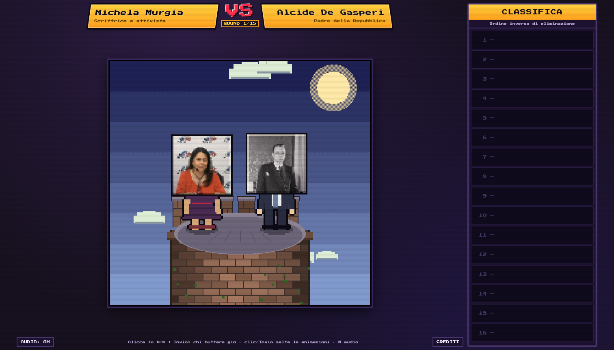

# Chi butti giù dalla torre?

Picchiaduro satirico **king of the hill** in pixel art, stile arcade anni '90
(Street Fighter II). Roster di 81 figure della storia pubblica italiana (36
donne) — dal fascismo a oggi, Michela Murgia inclusa. Ogni partita: Murgia +
**15 sfidanti estratti a caso** (15 duelli); clicca chi buttare giù, il
superstite affronta lo sfidante successivo finché resta un solo vincitore, e
ogni rivincita ripesca sfidanti nuovi. Ogni personaggio ha un **abito coerente** con la
sua storia (camicia nera, tuta spaziale, maglia da ciclista, tailleur…) e urla
una **frase biografica** mentre precipita.

> Satira. Nessuna persona è stata davvero buttata giù dalla torre.



## Gioca online

**[matteoscurati.github.io/chi-butti-giu-dalla-torre](https://matteoscurati.github.io/chi-butti-giu-dalla-torre/)**
(GitHub Pages, direttamente da questo repo).

## Avvio locale

**Opzione 1 — apri e gioca.** Fai doppio clic su `index.html` (funziona da
`file://`, nessuna build necessaria).

**Opzione 2 — server statico** (consigliato, evita eventuali restrizioni del
browser sui file locali):

```bash
# dalla cartella del progetto
python3 -m http.server 8000
# poi apri http://localhost:8000
```

Qualsiasi server statico va bene (`npx serve`, ecc.).

## Come si gioca

- Nel duello in cima alla torre, **clicca il personaggio da buttare giù** (sullo
  sprite oppure sul suo nameplate in alto).
- Chi stai per buttare giù **trema di paura e suda freddo**; il perdente cade
  urlando la sua frase biografica, con onomatopea; il superstite resta in cima e
  affronta il prossimo sfidante che sbuca dalla botola.
- La **classifica** a destra si riempie in ordine inverso di eliminazione: il
  primo buttato giù finisce 16°, il vincitore finale è 1° (ed esulta saltellando).
- Un clic durante le animazioni le **salta**. In basso: pulsante **AUDIO** e link
  ai **CREDITI**.
- **Tastiera**: `←`/`→` (o `A`/`D`) selezionano il bersaglio, `Invio`/`Spazio`
  confermano (e avviano/saltano/rigiocano), `Esc` annulla la selezione, `M`
  attiva/disattiva l'audio.

## Flag di debug (query string)

- `?auto=1` — partita automatica (sceglie a caso), utile per il collaudo.
- `?fast=1` — animazioni accelerate (x4).
- `?gallery=1` — griglia con tutti gli 81 personaggi (QA volti/abiti).

Esempio: `index.html?auto=1&fast=1`.

## Struttura

```
index.html            markup + overlay DOM
credits.html          GENERATA: pagina crediti stilata (link nel footer del gioco)
css/style.css         estetica arcade (nameplate, classifica, CRT)
js/
  data.js             GENERATO: window.CHARACTERS (dataset per il runtime)
  util.js             config + utilità (rng, easing, hash, pixelEllipse, ...)
  audio.js            SFX chiptune sintetizzati (WebAudio)
  camera.js           camera verticale (pan/follow/shake)
  sprites.js          volto foto (testone) + abito coerente + animazioni
  tower.js            cielo, torre di mattoni, suolo, pila di corpi
  fx.js               particelle, sudore, testo fluttuante, coriandoli
  share.js            condivisione classifica (card PNG / testo)
  ui.js               nameplate, banner, classifica, risultati
  states.js           macchina a stati (flusso del duello + fisica caduta)
  main.js             boot, game loop, input (mouse+tastiera), scaling
assets/faces/         81 volti (thumb da Wikimedia Commons)
assets/fonts/         Press Start 2P (+ licenza OFL)
characters.json       dataset canonico (deliverable)
CREDITS.md            GENERATO: fonte + autore + licenza di ogni volto
CHANGELOG.md          storia delle versioni (Keep a Changelog + SemVer)
LICENSE               MIT (codice; i volti mantengono le licenze Commons)
tools/fetch_faces.mjs script di download volti / generazione dataset+crediti
```

## Dettagli tecnici

- **HTML/CSS/JS vanilla**, Canvas 2D. Niente framework, niente build.
- Script classici (no ES module) e dataset in `js/data.js`: così tutto funziona
  anche aprendo il file da `file://` (dove `fetch` di JSON locali è bloccato).
- I volti sono foto ritagliate strette sul viso (**testone** riconoscibile),
  **pixelizzate** (downscale del canvas) e incorniciate, poi innestate su corpi
  pixel art disegnati a codice con **abito parametrico** (tipo/colore/accento,
  numero di maglia) coerente con il personaggio e adeguato al genere. Non si legge
  mai la memoria del canvas (`getImageData`/`toDataURL`), quindi il "taint" da
  `file://` non è un problema.
- **Animazioni "assolutamente 2D"**: niente rotazioni libere né scale frazionarie —
  tutto avviene a scatti sulla griglia dei blocchi (4px). Respiro come alternanza
  di due pose pre-renderizzate, tremolio quantizzato e sudore sul personaggio
  puntato (con cornice rossa lampeggiante + freccia), posa d'esultanza per il
  vincitore. Ogni personaggio è pre-renderizzato (baking) in testa + 5 frame.
- **Caduta con fisica reale ma tumbling arcade**: gravità e spinta verso
  l'esterno, corpo che ruota SOLO a scatti di 90° (pixel-perfect) alternando le
  pose, camera che segue, impatto con polvere, screenshake (solo traslazioni) e
  K.O.; i corpi si accumulano alla base sdraiati esatti.
- Risoluzione interna 640×600 scalata a passi di 0.25 con `image-rendering:
  pixelated` (nessun antialiasing). Rendering leggero (torre, cielo e sprite in
  cache): ~60fps. Personaggi ~40% dell'altezza schermo, proporzioni SF2.
- Audio interamente sintetizzato con WebAudio (nessun file audio da licenziare).

## Rigenerare i volti / il dataset

Richiede **Node ≥ 18** (usa `fetch` globale, zero dipendenze npm):

```bash
node tools/fetch_faces.mjs          # scarica i mancanti, rigenera i file
node tools/fetch_faces.mjs --force  # riscarica tutto
node tools/fetch_faces.mjs --check  # valida (81 volti, licenze, abiti, frasi)
```

Lo script interroga it.wikipedia (`pageimages`) → Wikimedia Commons
(`imageinfo`, con fallback su Wikidata `P18`), scarica i volti in
`assets/faces/` e rigenera `characters.json`, `js/data.js` e `CREDITS.md`.

Il roster (con genere, abito e frase di caduta di ogni personaggio) è definito
in `tools/fetch_faces.mjs`; ogni record del dataset include `gender`, `outfit`
(`{t,c,a,num?,tie?}`), `fallQuote` e un eventuale `faceRect` per correggere il
ritaglio del volto (frazioni `{x,y,w}`).

### Sostituzioni

Per 3 figure non esisteva una foto a licenza libera utilizzabile su
Commons/Wikidata (immagini caricate solo localmente su it.wiki, in fair use).
Come da specifica sono state sostituite con figure equivalenti e segnalate in
`CREDITS.md`:

- **Fabrizio De André** → **Lucio Dalla** (cantautore)
- **Marco Pantani** → **Pietro Mennea** (atleta)
- **Alberto Tomba** → **Dino Zoff** (atleta)

## Versioni e changelog

Il progetto segue il [Semantic Versioning](https://semver.org/lang/it/); ogni
release è un tag git `vX.Y.Z` e le modifiche sono documentate in
[`CHANGELOG.md`](CHANGELOG.md) (formato [Keep a Changelog](https://keepachangelog.com/it/1.1.0/)).

## Hosting

Il gioco è 100% statico (niente build, niente backend): qualunque hosting di
file statici va bene. Questo repo usa **GitHub Pages** (Settings → Pages →
branch `main`, cartella `/`), che pubblica direttamente da `main` a ogni push.
Alternative equivalenti: **itch.io** (ottimo per la visibilità come gioco,
upload zip), **Cloudflare Pages** / **Netlify** (deploy da repo, CDN).

## Crediti e licenze

- Un gioco di **Matteo Scurati**. Codice sotto licenza [MIT](LICENSE).
- Volti: Wikimedia Commons — fonte, autore e licenza di ciascuno nella
  [pagina crediti](https://matteoscurati.github.io/chi-butti-giu-dalla-torre/credits.html)
  (o [`CREDITS.md`](CREDITS.md)). Le licenze (PD, CC BY, CC BY-SA) sono
  mantenute dai derivati pixelizzati.
- Font: **Press Start 2P** di CodeMan38 — SIL Open Font License 1.1
  (`assets/fonts/OFL.txt`).

Progetto satirico, senza fini di lucro. Nessuno stato persistente, nessuna
autenticazione, nessun tracciamento.
